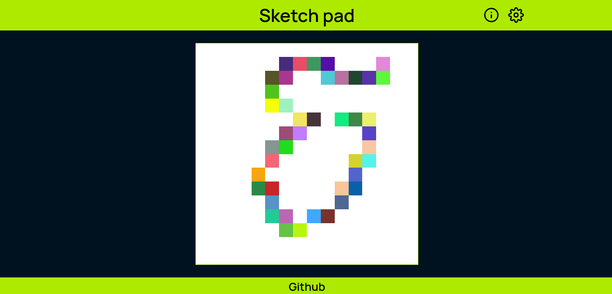

# sketch-pad

Sketch-pad es una pagina web para dibujar pixelart, en ella podrás utilizar lápiz y borrador, utilizar colores aleatorios o personalizados, ajustar la cuadricula e imprimir en tamaño A4.

Esta actividad forma parte del pensum de [The Odin Project](https://www.theodinproject.com/lessons/foundations-etch-a-sketch).

Visita una demo [**¡aquí!**](https://moramartin99.github.io/sketch-pad/).

